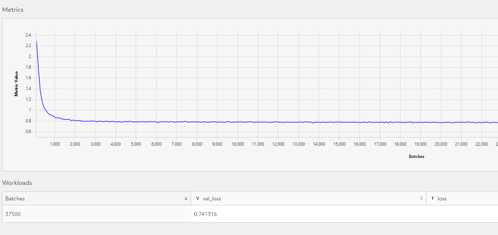

# Parkinson's Disease Progression Predictor 🧠

This project was submitted to [Determined AI's 2023 hackathon](https://determined-ai.devpost.com/). Check out our submission on [Devpost](https://devpost.com/software/parkinson-s-disease-progression-predictor)! 

We used [Determined Cloud](https://det-cloud.com/) to run our models and the [AMP®-Parkinson's Disease Progression Prediction](https://www.kaggle.com/competitions/amp-parkinsons-disease-progression-prediction/data) database from Kaggle.

### Project Objective 

Our goal is to predict the progression of [Parkinson's disease](https://www.nia.nih.gov/health/parkinsons-disease) in patients.

Using protein abundance data, our model predicts the severity of the symptoms a patient will face in a year. The severity of a patient's condition is measured through [MSD-UPDR](https://www.parkinsons.org.uk/professionals/resources/mds-unified-parkinsons-disease-rating-scale-mds-updrs) scores, which assess both motor and non-motor symptoms associated with Parkinson's. We chose to focus on one of these scores: UPDRS-3, which measures motor symptoms including speech, facial expression, and hand movement.

### Data Sample

Our model uses 50 input features from our protein abundance data in `train_proteins.csv` and outputs a prediction for the patient's UPDRS-3 score in year. These 50 features were chosen using scikit learn's `SelectKBest` feature selection class after being scaled and transformed.

Figure 1: The distribution of the model's 50 input features  


Figure 2: The expected score for a patient's UPDRS-3 score, 12 months after their visit. Note that `visit_id` is structured as `[patient_id]_[months_since_first_visit]`.


### Getting Started 

This section covers how to run our code as a Determined AI experiment with Linux and Determined Cloud. 

##### Determined Cloud Setup 
1. Create an account on [Determined Cloud](https://det-cloud.com/) 
2. Create a new cluster 
3. Copy the cluster URL 
4. Configure the `DET_MASTER` environment variable using `export DET_MASTER=<master ip>`   
5. Install the Determined CLI using `pip install determined`
6. Log in using `det auth login`

##### Running a Training Job
1. Clone this repository 
2. Enter the repository directory 
3. Run `det experiment create const.yaml .` 

Note: You can run the training job with adaptive or distributed training using one the following commands instead:

```
det experiment create adaptive.yaml .
det experiment create distributed.yaml .
```

### Evaluation Metrics and Results 

We used the symmetric mean absolute percentage error (sMAPE) metric to evaluate our regression model. This accuracy metric is based on percentage errors, with lower values being more desirable. 

### Best Metrics 

Using sMAPE, our model achieved a validation loss of 0.741316.


### Reproducing Results  

To reproduce these results, follow the steps under [Getting Started](#getting-started). 
